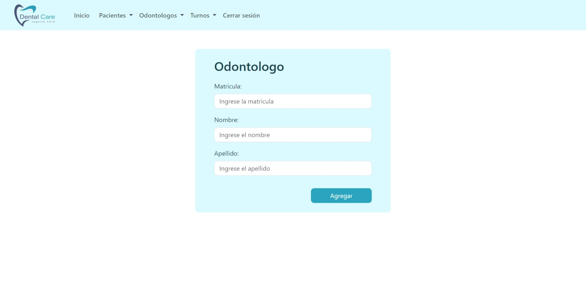
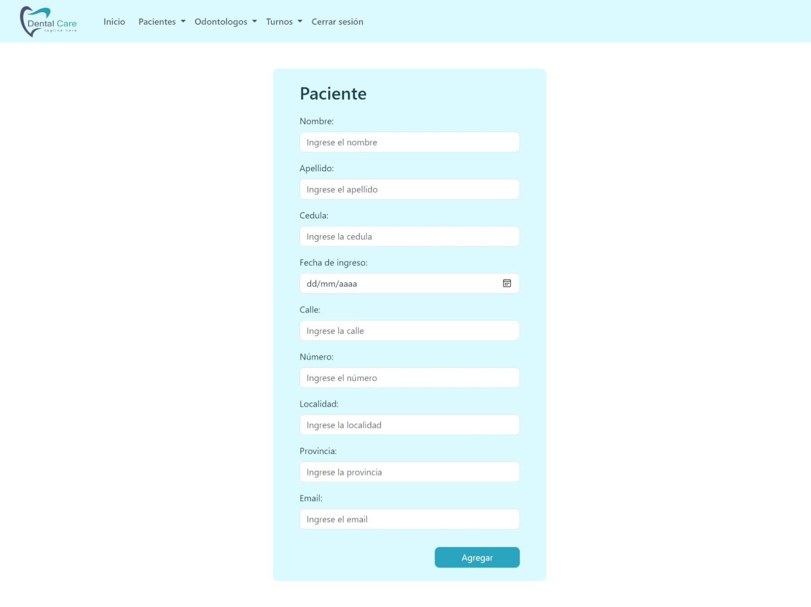
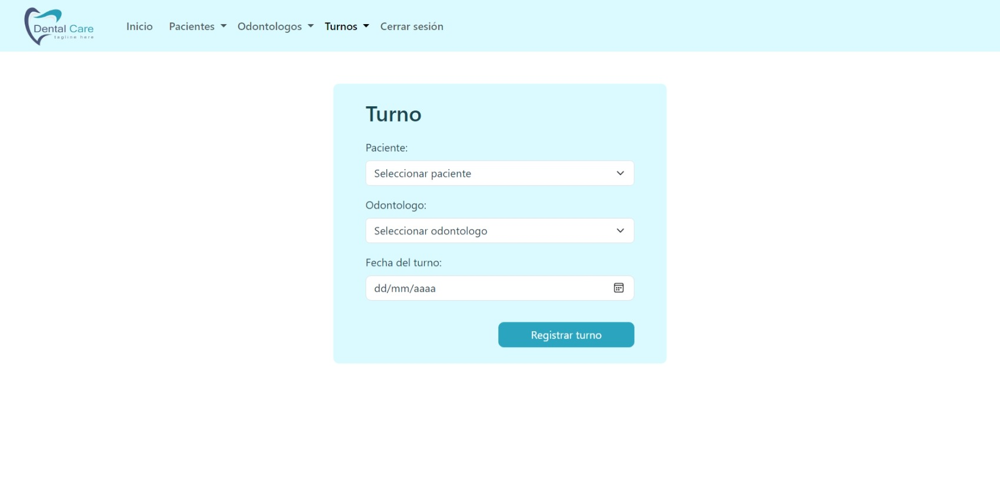
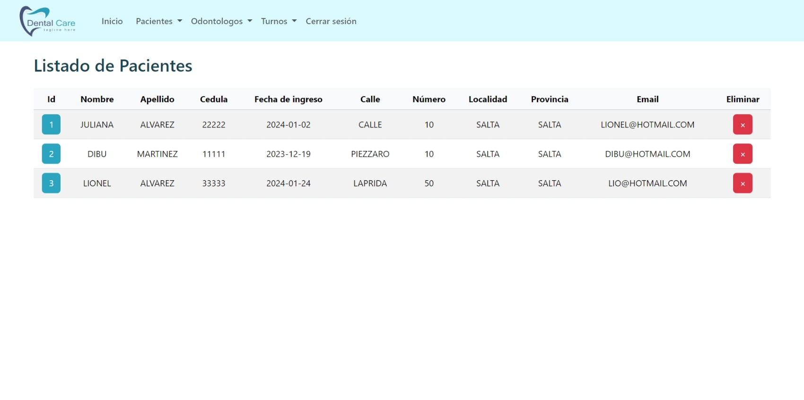
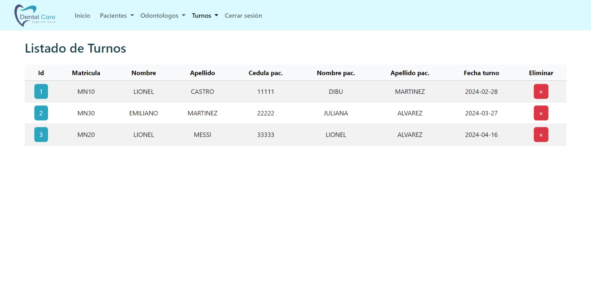
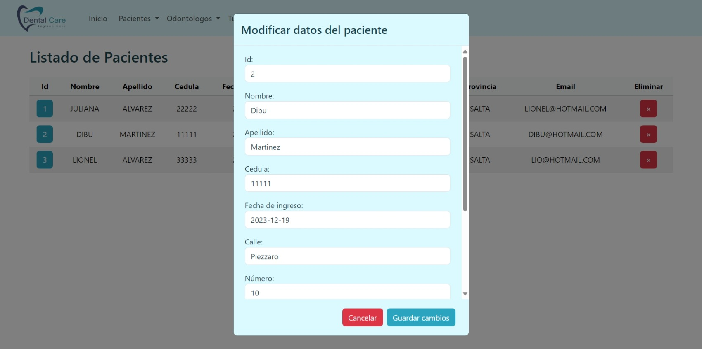
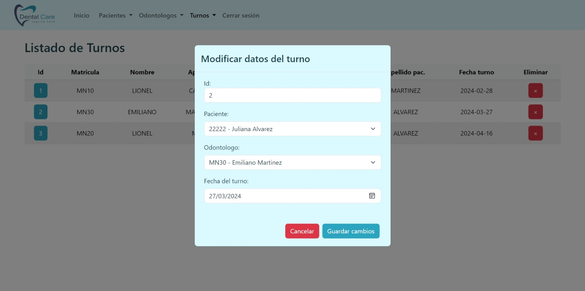

# Shift Management System - Dental Clinic

This project is a shift management application for a dental clinic. It allows you to manage appointments, patients and other aspects related to shift management in a dental clinic.


## Table of contents

- [Overview](#overview)
  - [The features](#the-features)
  - [Screenshot](#screenshot)
- [The process](#the-process)
  - [Built with](#built-with)
  - [Continued development](#continued-development)
- [Project configuration](#project-configuration)
- [Author](#author)


## Overview

### The features

- Optimal layout for the app depending on the device's screen size
- Hover states for all interactive elements on the page
- Log in
- Create, read, update, delete patients, dentist and shifts
- List patients, dentist and shifts
- Acces to API documentation

### Screenshot

Admin, home:


Admin, add dentist:



Admin, add patient:



Admin, add shift:



Admin, list patients:



Admin, list shifts:



Admin, update patients:



Admin, update shifts:



User, home:


## The process

### Built with

- Semantic HTML5 markup
- CSS custom properties
- [Bootstrap](https://getbootstrap.com/) - CSS framework
- [JavaScript](https://developer.mozilla.org/es/docs/Web/JavaScript) - Development (Frontend)
- [Java](https://www.java.com/es/) - Development (Backend with API rest)
- [Maven](https://maven.apache.org/) - Project management
- [Loombok](https://projectlombok.org/) - Anotations for development
- [Log4j](https://logging.apache.org/log4j/2.x/) - Log errors
- [Spring Boot](https://spring.io/projects/spring-boot) - For Spring framework
- [Spring Data JPA](https://spring.io/projects/spring-data-jpa) -  Implementation of data access
- [Hibernate](https://hibernate.org/) - ORM
- [Spring Security](https://spring.io/projects/spring-security) - Authentication and access-control
- [Spring Boot Test](https://docs.spring.io/spring-framework/reference/testing/unit.html) - Unit tests
- [MockMVC](https://docs.spring.io/spring-framework/reference/testing/spring-mvc-test-framework.html) - Integration tests
- [H2 Database](https://www.h2database.com/html/main.html) - SQL database
- [Swagger](https://swagger.io/) - API documentation


### Continued development

In the future, we will implement the frontend with React and Material UI.


## Project configuration

**Clone the Repository:**
   ```bash
   git clone https://github.com/DOF1109/proyecto-integrador-backend.git
   ```

**Configure the Database:**

The H2 database configuration is located in `src/main/resources/application.properties`.

**Run the app**

mvn spring-boot:run

**Access the app**

Open your browser and visit http://localhost:8081.


## Author

- LinkedIn - [Daniel Omar Frias](https://ar.linkedin.com/in/daniel-omar-frias)
- LinkedIn - [Ariel Federico Ibarbalz](https://ar.linkedin.com/in/ariel-federico-ibarbalz-222868237)
